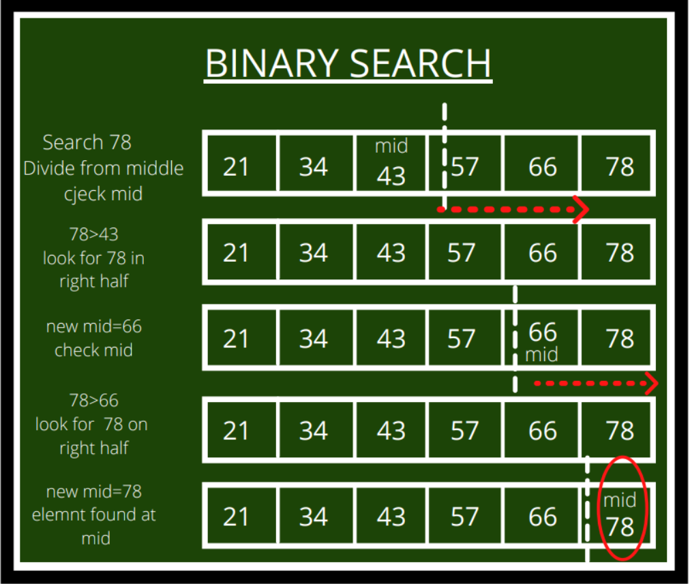

## LeetCode - @Ricardo Ferreira
The only way to keep your game at a very high level
is being challenged every day. Nice source of coding challenges at https://leetcode.com
Let's dive into it!
## _Tools_
- Java 21
- IntelliJ Community Edition
- Gradle

## _Table of contents_
- [LeetCode Challenge75 - @Ricardo Ferreira](#leetcode-challenge75---ricardo-ferreira)
- [_Tools_](#tools)
- [_Table of contents_](#table-of-contents)
- [_Screenshot_](#screenshot)
- [_Links_](#links)
- [_Built with_](#built-with)
- [_What I practiced_](#what-i-practiced)
- [_Continued development_](#continued-development)
  - [_Useful resources_](#useful-resources)
- [_Author_](#author)
- [Acknowledgments](#acknowledgments)


## _Screenshot_
[]()
## _Links_
- Live Site URL: [https://leetcode.com/u/rferreira_757/] 
## _Built with_
[](https://skillicons.dev)


 ## _What I practiced_
```java
public static boolean validAnagram(String s1, String s2) throws InterruptedException {
        logger.info("Starting Anagram.... - V2");
        startTimer();
        String regex = "\\s+";
        s1 = s1.replaceAll(regex, "").toLowerCase();
        s2 = s2.replaceAll(regex, "").toLowerCase();
        int lenStringOne = s1.length(), lenStringTwo = s2.length();
        logger.info(String.format("Length of each string provided as is: %d, %d", lenStringOne, lenStringTwo));
        if (lenStringOne != lenStringTwo) {
          logger.info("Its not feasible to have an anagram with the strings provided. Try again!");
          timeTaken();
          return false;
        }
        logger.info("Both strings are normalized..." + s1);
        char[] stringOne = s1.toCharArray(),stringTwo = s2.toCharArray();
        StringBuilder sbOne = new StringBuilder(), sbTwo = new StringBuilder();
        Thread thread = new Thread( () -> {
          Arrays.sort(stringOne);
          Arrays.sort(stringTwo);
          logger.info("Both strings are sorted...");
          for (char c : stringOne) {
            sbOne.append(c);
          }
          for (char c : stringTwo) {
            sbTwo.append(c);
          }
        });

        thread.start();
        thread.join();

        logger.info("Stopping watch...");
        timeTaken();
        stopWatchReset();
        return sbOne.toString().contentEquals(sbTwo.toString());
        }

``` 

## _Continued development_
- Next step: Threads, Concurrency, Parallelism. ExecutorService and CompletableFuture
- 
### _Useful resources_
- [https://docs.oracle.com/en/java/]  Always trust and read the official documentation!
- [https://cp-algorithms.com/]  A must stop by to tackle DSA...
## _Author_
- Website - [https://www.ferreiras.dev.br]  
## Acknowledgments
